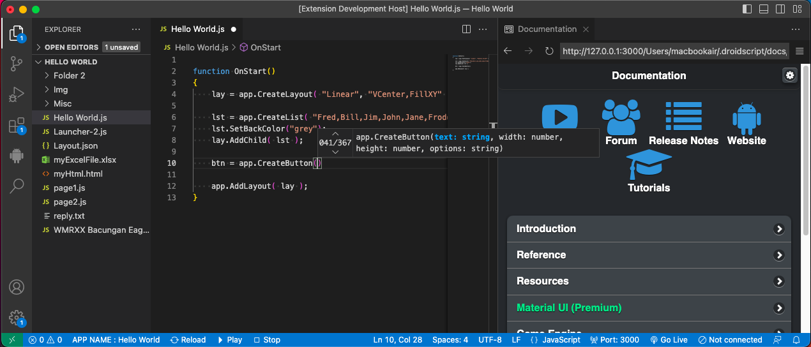
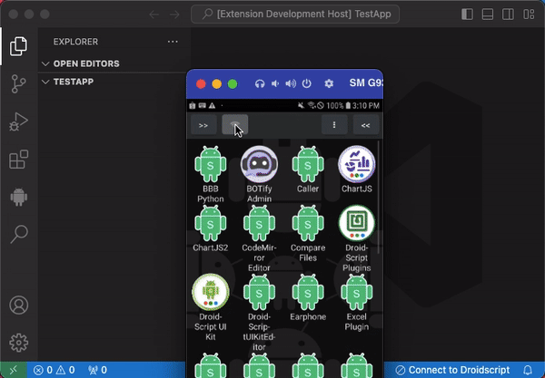
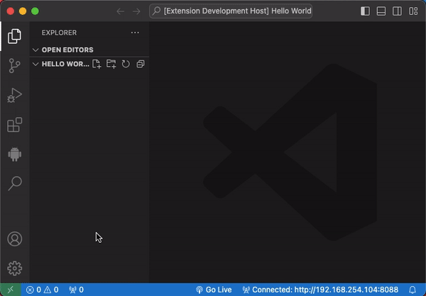
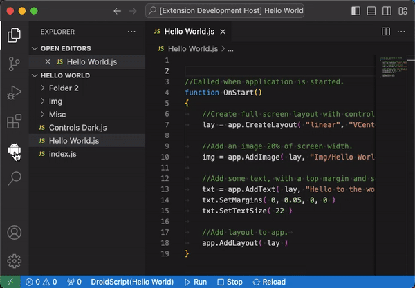
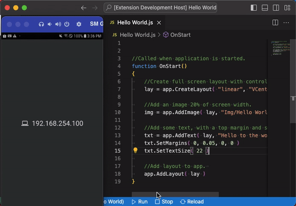
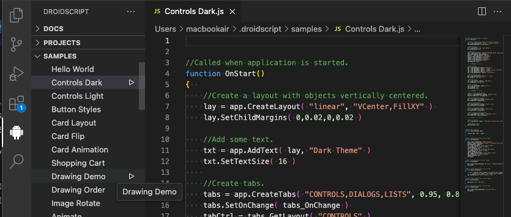

# DroidScript - Create Android Apps Using JavaScript

[DroidScript](https://droidscript.org/) is an easy to use, portable coding tool which simplifies android app development. It dramatically improves productivity by speeding up development by as much as 10x compared with using the standard development tools.

It’s also an ideal tool for learning JavaScript, you can literally code anywhere with DroidScript, it’s not cloud based and doesn’t require an internet connection.

Unlike other development tools which take hours to install and eat up gigabytes of disk space, you can install DroidScript in your phone and start using it within 30 seconds!

### Download DroidScript app from [Google Play](https://play.google.com/store/apps/details?id=com.smartphoneremote.androidscriptfree)

## Requirements

* You should have DroidScript app installed in your phone.
* The phone and this laptop/desktop should be connected to the same WiFi network.

> For version 0.27 and above, the documentation is displayed on the right panel served locally. To view docs smoothly, install the `"Live Preview"` extension [here](https://marketplace.visualstudio.com/items?itemName=ms-vscode.live-server).

## How to connect to DroidScript?

- Open DroidScript app on your phone and press the WiFi icon to start the DS WiFi IDE server. You should be able to see the IP Address on the popup message.
- Click the **"Connect"** button in the Projects section or in the Samples section. You can also click the **"Connect to DroidScript"** button in the bottom right corner.
- A popup will be displayed where to enter **"IP Address"** and **"Password"** if necessary.

## How to open an app?

- If you are successfully connected, go to **DroidScript** view.
- Expand the **"PROJECTS"** section and select the project you want to open.
- A popup message will open on the bottom right for confirmation.

## How to create an app?

- Go to **DroidScript** view.
- In the **"PROJECTS"** section title, click the **`"+"`** icon at the right.
- A quick pick popup will be shown at the top. Select the type of app and follow the next step to "Enter app name" and "App type".

## How to rename an app?

- Go to **DroidScript** view.
- Expand the **"PROJECTS"** section.
- Hover on the app you want to rename and click the **"Pencil"** icon.
- A popup message will open on the bottom right for confirmation.

## How to delete an app?

- Go to **DroidScript** view.
- Expand the **"PROJECTS"** section.
- Hover on the app you want to remove and click the **"Trash Bin"** icon.
- A popup message will open on the bottom right for confirmation.

## Play, Stop and Reload Project

At the bottom of VS Code, in the status bar you can see three icon buttons added, namely: **Reload**, **Play**, **Stop**.

- **Reload** - This will reload the current project files. Before you start editing your code, it is best practice to reload first in order to retrieved the updated files in your DroidScript project.
- **Play** - Run your DroidScript app.
- **Stop** - Stop the currently running app.

## Docs and Samples

Navigate to DroidScript panel in the SideBar to open DroidScript docs and samples.

## Best Practices

- Everytime you start editing your project, it is a good idea to reload the files to fetch any changes on the Project. Click the **Reload** button or run the `DroidScript: Reload` command.
- When you are working in VS Code, **DO NOT EDIT THE FILES IN THE WIFI IDE**.

## Known Issues

- None so far.

 

#### Author
- **GineersLife:** Jumar Hamac - *hamacjumar@gmail.com*
