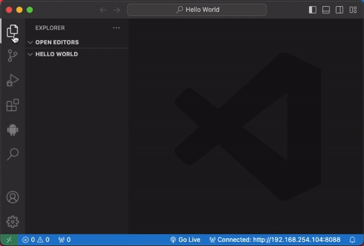
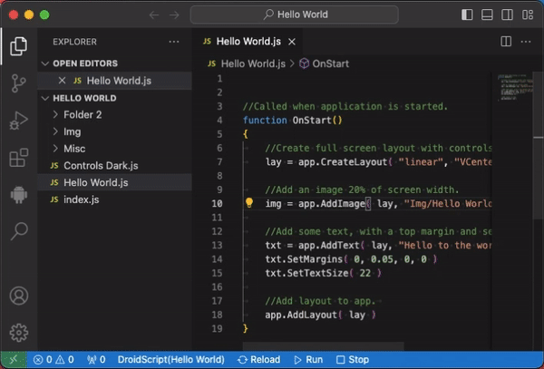
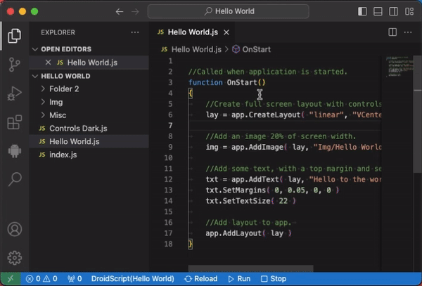
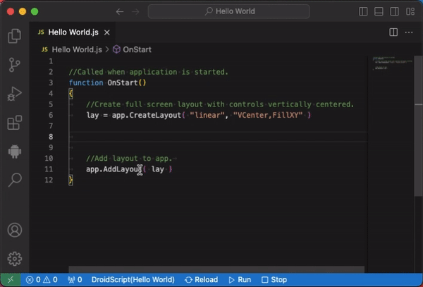

# DroidScript - Create Android Apps Using JavaScript

[DroidScript](https://droidscript.org/) is an easy to use, portable coding tool which simplifies android app development. It dramatically improves productivity by speeding up development by as much as 10x compared with using the standard development tools.

It’s also an ideal tool for learning JavaScript, you can literally code anywhere with DroidScript, it’s not cloud based and doesn’t require an internet connection.

Unlike other development tools which take hours to install and eat up gigabytes of disk space, you can install DroidScript in your phone and start using it within 30 seconds!

### Download DroidScript app from [Google Play](https://play.google.com/store/apps/details?id=com.smartphoneremote.androidscriptfree)

## Requirements

* You should have DroidScript app installed in your phone.
* The phone and this laptop/desktop should be connected to the same WiFi network.

> For version 0.27 and above, the documentation is displayed on the right panel served locally. To view docs smoothly, install the `"Live Preview"` extension [here](https://marketplace.visualstudio.com/items?itemName=ms-vscode.live-server).

## How to connect to DroidScript?

- Open DroidScript app on your phone and press the WiFi icon to start the DS WiFi IDE server. You should be able to see the IP Address on the popup message.
- Click the **"Connect"** button in the Projects view or in the Samples view. You can also click the **"Connect to DroidScript"** button in the bottom right corner.
- A popup will be displayed where to enter **"IP Address"** and **"Password"** if necessary.

## How to open an app?

- If you are successfully connected, go to **DroidScript** section.
- Expand the **"PROJECTS"** view and right-click on the project you want to open.
- A popup message will open on the bottom right for confirmation.

## How to create an app?

- Go to **DroidScript** section.
- In the **"PROJECTS"** view title, click the **`"+"`** icon at the right.
- A quick pick popup will be shown at the top. Select the type of app and follow the next step to "Enter app name" and "App type".
> You can also right-click on any app and select the `"Create new app"` item in the context menu.

## How to rename an app?

- Go to **DroidScript** section.
- Expand the **`"PROJECTS"`** view and right-click on the app you want to rename.
- Select **`"Rename"`** item in the context menu and enter the new name.

## How to remove an app?

- Go to **DroidScript** section.
- Expand the **`"PROJECTS"`** view and right-click on the app you want to remove.
- Select **`"Remove"`** item in the context menu.
- A popup message will be shown in the bottom right for confirmation.

## Running or stopping an app

At the bottom of VS Code in the status bar, you can see the **`"Run"`** and **`"Stop"`** icon button.

- **Play** - Run the currently opened DroidScript app.
- **Stop** - Stop the currently running app.

## Documentation

- Go to **DroidScript** section.
- Expand the **`"DOCS"`** view and select **`"Documentation"`** tree item.
> A live preview window will be open in the right panel of VS Code.

## Samples

- Go to **DroidScript** section.
- Expand the **`"SAMPLES"`** view and right-click on the sample you want to open or run.

## Intellisense

Completion items for `app`, `ui` and `MUI` scopes are provided in the extension. You can also hover to any `app`, `MUI` and `ui` methods to display a definition popup. Signature help is also provided so you can look at parameter names, types and descriptions while passing arguments to methods in each scope.

## Best Practices

- Everytime you start editing your project, it is a good idea to reload the files to fetch any changes on the Project. Click the **Reload** button in the bottom of VS Code.
- When you are working in VS Code, **DO NOT EDIT THE FILES IN THE WIFI IDE**.

## Known Issues

- None so far.

 

#### Author
- **GineersLife:** - *hamacjumar@gmail.com*
- **Symbroson:** - *alex-Symbroson@gmail.com*
