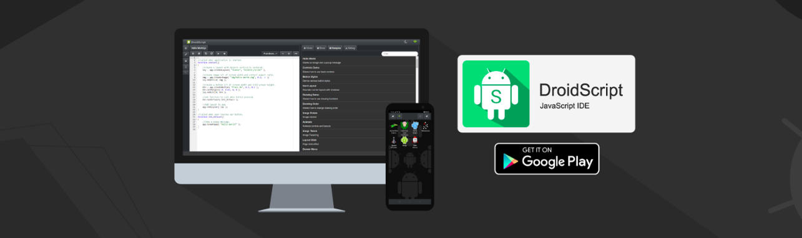
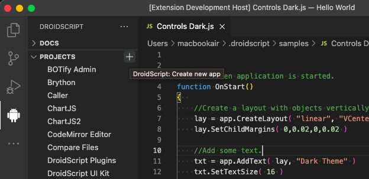
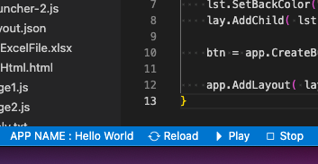

# DroidScript - Create Android Apps Using JavaScript

### Download DroidScript app from [Google Play](https://play.google.com/store/apps/details?id=com.smartphoneremote.androidscriptfree)

## What is DroidScript

[DroidScript](https://droidscript.org/) is an easy to use, portable coding tool which simplifies android app development. It dramatically improves productivity by speeding up development by as much as 10x compared with using the standard development tools.

It’s also an ideal tool for learning JavaScript, you can literally code anywhere with DroidScript, it’s not cloud based and doesn’t require an internet connection.

Unlike other development tools which take hours to install and eat up gigabytes of disk space, you can install DroidScript in your phone and start using it within 30 seconds!

## About this extension

An extension to create, edit and run DroidScript apps directly in Visual Studio Code.

## Features

1. Create DroidScript projects in VS Code.
2. Initialize local folder as DroidScript project.
3. Edit DroidScript project files in VS Code.
4. Add, rename and delete DroidScript files in VS Code.
5. Run and Stop programs directly in VS Code.
6. Local folders initialized as DroidScript project serves as back up. You can then use Git to back up your files on GitHub.
7. DS Docs is directly in VS Code at DroidScript Panel section.
8. Samples can be viewed, copy and run directly in VS Code.
9. Upload, rename and delete DS projects assets directly in VSCode.

## Requirements

* You should have DroidScript app installed in your phone.
* The phone and this laptop/desktop should be connected to the same WiFi network.

> For version 0.27 and above, the documentation is displayed on the right panel served locally. To view docs smoothly, install the `"Live Preview"` extension [here](https://marketplace.visualstudio.com/items?itemName=ms-vscode.live-server).

## How to use?

Here are the steps in order to start editing your DroidScript projects in VS Code.

1. Open DroidScript app on your phone and press the WiFi icon to start the DS WiFi IDE server. You should be able to see the IP Address on the popup message.
2. Create a folder in your laptop or desktop and open it in VS Code.
3. Once the VS Code is open, run **`DroidScript: Initialize`** command from the command pallete. Press (Shift - Ctrl/Cmd - P) to open command pallete.
4. When you run **DroidScript: Initialize** command, it will first display a popup where to `Enter IP Address`. Enter the IP Address as shown in DroidScript app.
5. If the IP Address is correct, another popup where to `Enter Password` is shown. Type your password and press `Enter`.
6. If the password is correct, a list dialog popup with the list of your DroidScript projects will be shown. Please select the project you want to work with.

You can now start editing your project files.

> Tip: Make sure that a specific directory is associated to a specific DroidScript project. To open another DroidScript project, initialize another folder. This is to avoid files of multiple projects scrambled in one directory.

## Creating an app

Navigate to DroidScript panel in the SideBar to open DroidScript docs, projects and samples. Hover in the projects view title "PROJECTS", you can see the `"plus"` icon. Click it and choose the app type in the popup dialog.

## Play, Stop and Reload Project

At the bottom of VS Code, in the status bar you can see three icon buttons added, namely: **Reload**, **Play**, **Stop**.

- **Reload** - This will reload the current project files. Before you start editing your code, it is best practice to reload first in order to retrieved the updated files in your DroidScript project.
- **Play** - Run your DroidScript app.
- **Stop** - Stop the currently running app.

You can also you use command from the command pallette.

- **Reload** - `DroidScript: Reload` command
- **Play** - `DroidScript: Run` command
- **Stop** - `DroidScript: Stop` command

## Docs and Samples

Navigate to DroidScript panel in the SideBar to open DroidScript docs and samples.

## All Commands

- `DroidScript: Initialize` - Initialize directory as a DroidScript project.
- `DroidScript: Reload` - Reload the files in the current folder.
- `DroidScript: Run` - Run the app associated with project folder.
- `DroidScript: Stop` - Stop the currently running DS app.

## Best Practices

- Everytime you start editing your project, it is a good idea to reload the files to fetch any changes on the Project. Click the **Reload** button or run the `DroidScript: Reload` command.
- When you are working in VS Code, **DO NOT EDIT THE FILES IN THE WIFI IDE**.

## Known Issues

- None so far.

 

#### Author
- **GineersLife:** Jumar Hamac - *hamacjumar@gmail.com*
