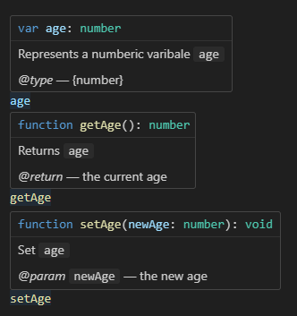
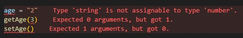

## Contents

- [Types in DroidScript](#types-in-droidscript)
  - [Migrate your project](#migrate-your-project)
- [Type-Safety](#type-safety)
  - [Types in JavaScript?](#types-in-javascript)
- [JSDoc](#jsdoc)
  - [JSDoc Syntax](#jsdoc-syntax)
  - [Inference](#inference)
  - [Type Intersections](#type-intersections)
  - [Optional types](#optional-types)
  - [Type examples](#type-examples)

# Types in DroidScript

If you don't know how to use types in JavaScript code, please check out the section [Type-Safety](#type-safety) and [JSDoc](#jsdoc) below.

To start using types in DroidScript you need to enable type checking for your project. In this vscode-extension this is done automatically by adding a `jsconfig.json` file to your project folder. It contains several configurations and paths for a basic type checking setup. Documentation of additional compiler flags can be found in the [VSCode jsconfig.json Reference](https://code.visualstudio.com/docs/languages/jsconfig).

Type checking in the vscode-extension is based on typescript definition files that are generated based on the [DroidScript documentation](https://github.com/DroidScript/Docs). If you find any issues with the typing system please report them there.

## Migrate your project

Initially after enabling type checking you might be overwhelmed with red wall full of error messages, but this guide will help you get through that!

Probably the most number of errors are caused by undeclared global variables. I's important to remember that you need to **declare** all varibales in order to assign a type to them. This is done with the `var`, `let` or `const` keyword. Do this for all your local and global variables. This is an example of a typed 'Hello World' app:

```js
/** @type {DsButton} */
var btn;

function OnStart()
{
    const lay = app.CreateLayout( "linear", "VCenter,FillXY" )

    const img = app.AddImage( lay, "/Sys/Img/Hello.png", 0.2 )
    
    btn = app.AddButton( lay, "Press Me", 0.3 )
    btn.SetOnTouch( btn_OnTouch )
    btn.SetMargins( 0, 0.05, 0, 0 )
    
    app.AddLayout( lay )
}

function btn_OnTouch()
{
    btn.SetText( "Press Me Again!" )
}
```

The second thing you want to do after declaring your global variables is documenting the parameters and return types of all your functions.

A tool that might help in the process is the _Infer from usage_ feature. Simply right-click an undocumented parameter and let vscode try to assign types based on how they are used in the following code. You can also use _infer all types from usage_, but be beware that vscode has limited knowledge of your types and might not get them exactly how you want.\
An important part is identifying which parameters are actually optional, which values they hold by default and how to handle the different type cases.

After that you can work on improving your code quality by applying the newly gained type knowledge. You usually need to handle a few more edge cases of possibly undefined variables or making variables local that were previously global for no reason. Also use concise and unique names to avoid name clashes.

# Type-Safety

Type safe languages have great benefits over type-unsafe languages.
You always know what type of value a variable holds at all times.
And you always know which values you can pass to a functions, and which ones you can't.

With type-safety you can eliminate a large portion of software bugs only by using variables incorrectly.
It also opens the ability to do **autocomplete** and **lint** your code, also known as **intellisense**.

## Types in JavaScript?

Javascript is a dynamically typed language and not type safe. You can re-assign variables as you please, access global objects even if they may be undefined, and call functions with fewer or more arguments than specified.

You might already know **TypeScript**, a variation of JavaScript that aims to make JavaScript type-safe. Although very handy, TypeScript requires a dedicated compiler that transforms the code back to regular JavaScript. This is where **JSDoc** comes into play.

# JSDoc

JSDoc enables us to add types to regular JavaScript code via comment blocks. It supports most features of the TypeScript typing system and is the perfect fit for any JavaScript project. Detailed information is available at [TypeScript JSDoc Reference](https://www.typescriptlang.org/docs/handbook/jsdoc-supported-types.html). The basics are also covered in the next section:

## JSDoc Syntax

You can start any JSDoc comments with a comment block starting with two asterisks `/** */`
Any text will be interpreted as description for the variable it precedes.
Additionally you can add special tags to your JSDoc comment to specify the type further.
The most common ones are `@type`, `@param` and `@return`.
Here are some examples using JSDoc:
```js
/** 
 * Represents a numberic varibale `age` 
 * @type {number}
 */
var age;

/** 
 * Returns `age`
 * @return {number} the current age
 */
function getAge() {
    return age;
}

/**
 * Set `age`
 * @param {number} newAge the new age
 */
function setAge(newAge) {
    age = newAge;
}
```
These definitions will produce the following type hints:\


If we now try to use them the wrong way, we will be alerted by the linter:\


## Inference

You don't have to type everything. You can actually leave out a large portion of types that are inferred automatically, if they are based on an other variable with a known type.
```js
// getAge() returns `number`, so `a` also gets the type `number`
var a = getAge();

// list is initialized with an array and gets the type `number[]`
var list = [1, 2, 3, 4];
```

## Type Intersections

You can still tell the linter that a variable holds multiple types. This can be done by combining them with the `|` operator. When you do this, autocomplete only picks up properties that are available on both types.\
Although less common, you can also merge types with the `&` operator. Then all properties from both types will be autocompleted.\
```js
/** @param {string | number} age */
function parseAge(age) {
    if (typeof age === "number") return age;
    return Number(age);
}
```
Note how we don't specify the return type of the function as it will be inferred by the linter. You might want to document it anyways in this case so that you can't accidentally return a different type from the function.

You will also notice that after the first return statement, the type of age has changed from `string | number` to only `string`. This is because the linter picks up our `typeof` check, and knows `age` can't be `number` after that condition. This way you can make sure to handle all type cases properly.

## Optional types

Optional values are a way of telling that a variable or argument can be `undefined` or leaved out.
Here are some examples, which are all equivalent:
```js
/** @param {number | undefined} delta */
function addAge(delta) {
    // delta is `number` or `undefined`
    if (delta === undefined) age++;
    else age += delta;
}

/** @param {number} [delta] */
function addAge(delta) {
    // delta is `number` or `undefined`
    if (delta === undefined) age++;
    else age += delta;
}

/** @param {number} delta */
function addAge(delta = 1) {
    // we use a default parameter - delta is only `number`
    age += delta;
}

/** @type {(delta?: number) => void} */
function addAge(delta = 1) {
    // delta is `number`
    age += delta;
}
```

## Type examples
This section covers some common type patterns that you might come across.
```js
/** @typedef {number[]} NumberList */
/** @typedef {{[key: string]: number}} NumberDict */
/** @typedef {{name: string, age: number, tel?: number}} PersonObject */

/** @typedef {1 | 2 | 3 | 4} DiscreteNumbers */
/** @typedef {"add" | "sub" | "mul" | "div"} DiscreteStrings */
/** @typedef {{type: "num", data: DiscreteNumbers} | {type: "str", data: DiscreteStrings}} DiscreteObjects */

/**
 * @typedef {Object} ComplexObject
 * @property {string} name name of the person
 * @property {number} age age of the person
 * @property {number} [tel] optional tel number
 */

/**
 * @callback MyFunction Creates a person object
 * @param {string} name name of the person
 * @param {number} age age of the person
 * @param {number} [telephone = 0] optional tel number
 * @return {PersonObject}
 */

/** @type {<T>(obj: T) => (keyof T)[]} */
function keys(obj) {
    // @ts-ignore Type 'string[]' is not assignable to type '(keyof T)[]'
    return Object.keys(o || []);
}

/** 
 * @template T 
 * @param {Promise<T>[]} tasks
 */
async function dotasks(...tasks) {
    return await Promise.all(tasks);
}

```

For more information, please visit the [TypeScript JSDoc Reference](https://www.typescriptlang.org/docs/handbook/jsdoc-supported-types.html)